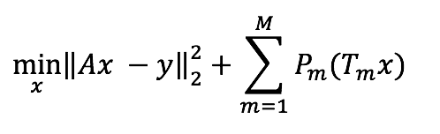

# Modifying-BART-for-MRI-reconstruction

[BART](https://mrirecon.github.io/bart/) is a well-designed reconstruction tool for magnetic resonance imaging. There are also plenty examples on their website explaining how to use BART. Here, I want to explain my understanding of BART (more specifically, the pics function in BART), hopefully it will make the use of BART eaiser for you, and even help you implemente you own reconstruction method. 

## Explanation of BART
BART (version 0.3.01) provides different solvers (e.g., ISTA, POCS, FISTA, ADMM) to solve the problem in the following format,

  

where:

  

The first term is the data consistency term, which is about how the data is acquired, the second term is the sum of the regularization terms (usually one or two terms) you want to apply. 

The input to the solver (which is the pics function) is simply the k-space (y) and sensitivity map (S), and it will output the image (x). While you need to define what regularization terms you want to use (check by '-h' option or read the code). I have a list of the existed terms in slide 2 in "pics/BART.pptx". You may want to check their website for the latest versions.

There are several algorithms to solve this kind of problems (L2 term + constraints). FISTA and ADMM have been implemented in BART. I would recommend [Prof. Stephen Boyd's convex optimization class](http://web.stanford.edu/class/ee364a/) and book if you have interest in how these algorithms work. Here we only need to know that only proximal operator of the regularization is needed for these algorithms.

## How to write you own reconstruction based on BART
The good thing of BART is that it has well implementation of these algorithms. To you have own reconstruction, usually, you only need to define some operators: (1) linear operators in the data consistency term, (2) the [proximal operator](https://en.wikipedia.org/wiki/Proximal_operator) for the regularization term. 

The previous loss function can be simplied as the following one:

  

where A is the combination of sampling (D), Fourier transform (F), and sensitivity encoding (S) operators (track the "forward_op" in pics.c). What BART does in pics is first to define each operator and then chain/combine them with the "linop_chain" operator. For the low-rank + sparse reconstruction, we only need to add another linear operator (T) before sensitivity encoding operator, which sums up these two components. If you only want to change the regularization temr, you do not even need to touch this part. 

Then the next part is about the regularization term, BART is very flexible since it requires a linear transform operator (T) associated with each regularization term (usually it is identitiy operator). Again for the low-rank + sparse reconstruction, we want to have 

(1) one regularization term on the low-rank component, which is pretty the same as previous low-rank opertor except we need to change the identity tranasform to a linear transform that takes the low-rank part;

(1) the other regularization term on the sparse component. Similarlly, this is pretty the same as previous l1-loss opertor except we need to change the identity tranasform to a linear transform that takes the sparse part.

You also probably need to name your new constraint in the function, and I would suggest you to just follow BART's implementation. Then you can run your own reconstruction. 

To summarize, to implementation your own reconstruction (BART may not be a good option for some complicated exponential models or non-linear models?), you only need to define you own linear transform operator (for both the data consistency term and the regularization term), and the proximal operator of the regularization term. BART has implemented many linear operators under /scr/linops and many proximal operators under /src/iter. I would suggest you do a survery before you implement your owns.

## Notes
The plan for this repository is to share my implementation of low-rank + sparse reconstruction based on BART. However, very unfortunately I could not find my implementation (this is probably one reason why I should use Github). But the implementation should be pretty straightforward after you understand how BART works and what changes you want to make. Hopefully the comments are helpful enough so you do not need to suffer my code. 
