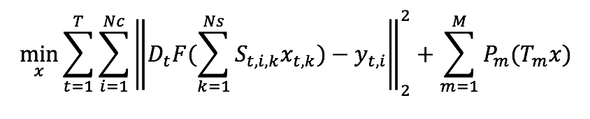
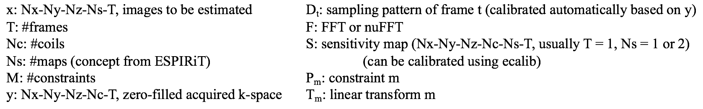

# Modifying-BART-for-MRI-reconstruction

[BART](https://mrirecon.github.io/bart/) is a reconstruction tool for magnetic resonance imaging. One good thing of using BART is that it provides different solvers (e.g., ISTA, POCS, FISTA, ADMM) to solve the problem in the following format,

  

where:

  

Sometimes, we may want to change the data consistency term. Here we give one example of including another linear operator (function ** about the forward operator ** about the conjugate operator in .*c) in the data consistency term, so that it becomes $DFSAx - y$. To achieve this, we only need to define the operator A and its transpose operator for gradient calculation. The $A$ we are implementing is equal to [I, I], which can be used for low-rank + sparse reconstruction. 

